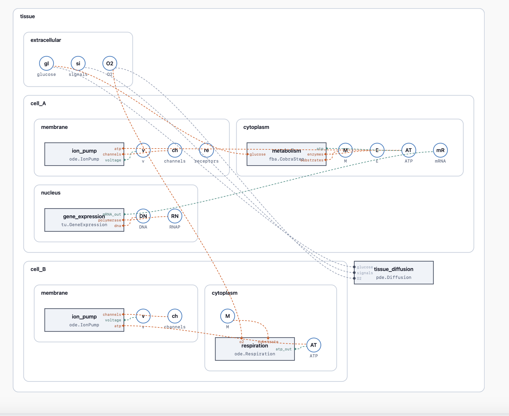

# bigraph-viz2

A lightweight, interactive, read-only renderer for
[process-bigraph](https://github.com/vivarium-collective/process-bigraph)
composites. Drop-in replacement for `bigraph-viz`'s static PNG output in
HTML reports — **no graphviz dependency**, pan / zoom / click-to-inspect /
double-click-to-collapse / Alt-drag-to-rearrange in the browser, and the
entire renderer inlines into a self-contained ~40 KB snippet.



The example above shows a two-cell tissue with nested substores (membrane,
cytoplasm, nucleus), processes living inside each, and wires reaching
across container boundaries. Orange = input port, teal = output port.

## Install

```bash
pip install bigraph-viz2
```

No graphviz. No node. No browser at install time. The JS bundle is
vendored inside the Python package; consumers need only Python ≥ 3.10.

## Use

The Python API has one main function and a Jupyter wrapper.

```python
from bigraph_viz2 import emit_html

# one-shot: a self-contained HTML fragment you can paste anywhere
snippet = emit_html(composite_state, height="600px")
report_html = report_html.replace("{{BIGRAPH}}", snippet)
```

In a Jupyter notebook:

```python
from bigraph_viz2 import BigraphViz
BigraphViz(composite_state)   # auto-displays via _repr_html_
```

For pages with **multiple viz instances**, inline the bundle once and
dedupe the rest:

```python
snippets = [emit_html(specs[0], dedupe=False)]
for spec in specs[1:]:
    snippets.append(emit_html(spec, dedupe=True))
```

### API

```
emit_html(state, *,
          height="500px",
          width="100%",
          inspector=True,         # show the right-side inspector panel
          theme="light",          # only "light" supported in v0.1
          dedupe=False,           # set True after the first call on a page
          id=None,                # explicit DOM id (auto-generated otherwise)
          max_row_width=480       # auto-wrap threshold inside each container
          ) -> str
```

Returns a self-contained HTML fragment.

### Interactions

| gesture                              | effect                                     |
| ------------------------------------ | ------------------------------------------ |
| drag (anywhere)                      | pan                                        |
| wheel                                | zoom centered on cursor (0.25× – 4×)       |
| hover a port                         | tooltip with port name                     |
| click a node                         | populate the inspector                     |
| double-click a node                  | collapse / expand subtree                  |
| Alt + drag a node                    | reorder siblings; drop into row / new row  |
| Esc (while dragging)                 | cancel the drag                            |

Collapse state persists in the URL hash and survives reload.

## Concepts

`bigraph-viz2` renders [compositional bigraph
schemas](https://github.com/vivarium-collective/process-bigraph) with
three primitive shapes:

| shape                  | meaning                                                       |
| ---------------------- | ------------------------------------------------------------- |
| **circle**             | a *variable* — a leaf in the place graph                      |
| **rounded rectangle**  | a *store* — a container nesting substores, processes, variables |
| **sharp rectangle**    | a *process* — reads from / writes to its declared ports       |

A composite is a tree of stores; processes live anywhere inside that
tree. Each process declares **ports**, which connect by **wire** to
variables — possibly across multiple container boundaries. Ports render
as small triangles on the edge of the process rectangle:

- **orange ▶** — input port (variable feeds the process)
- **teal ▶** — output port (process writes to the variable)
- **gray ·** — undirected (direction not declared in the spec)

Port direction is read from the spec's `inputs:` / `outputs:` blocks
(preferred), or from a single `ports:` block (treated as undirected for
back-compat with existing `bigraph-viz` specs).

### Example spec

```python
spec = {
    "name": "cell",
    "stores": {
        "membrane": {
            "v":        {"_type": "variable", "value": -70},
            "channels": {"_type": "variable", "value": []},
        },
        "cytoplasm": {
            "M":   {"_type": "variable", "value": 1.0},
            "ATP": {"_type": "variable", "value": 2.0},
            "metabolism": {
                "_type": "process",
                "address": "fba.CobraStep",
                "config": {"model": "iJO1366"},
                "inputs":  {"substrate": ["M"]},
                "outputs": {"atp":       ["ATP"]},
            },
        },
        "diffusion": {
            "_type": "process",
            "address": "ode.IonFlux",
            "config": {},
            "inputs":  {"voltage":  ["membrane", "v"]},
            "outputs": {"channels": ["membrane", "channels"]},
        },
    },
}

from bigraph_viz2 import emit_html
html = emit_html(spec, height="500px")
```

Wire paths are relative to the process's enclosing store (`["M"]` = the
sibling named `M`; `["..", "membrane", "v"]` = up to the enclosing store,
then into `membrane.v`).

## Development

```bash
git clone https://github.com/vivarium-collective/bigraph-viz2
cd bigraph-viz2

# build the JS bundle and vendor it into py/
bash scripts/vendor.sh

# JS tests + typecheck
cd js && npm test && npm run typecheck

# JS end-to-end smoke (real browser)
cd js && npm run test:e2e

# Python tests (includes a Playwright round-trip)
cd py && pip install -e ".[test]" && pytest
```

## Status

v0.1 — initial release.

## License

Apache-2.0.
